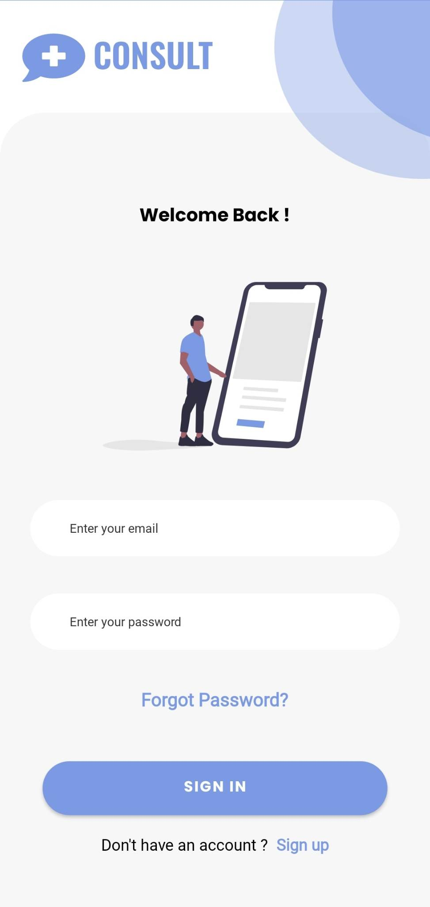
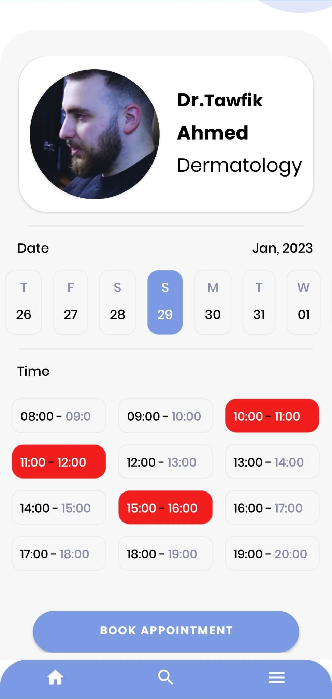
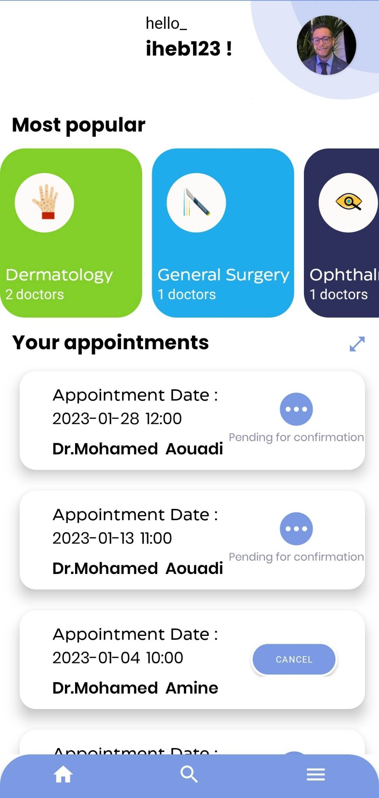

```html
<!DOCTYPE html>
<html>
  <head>
    <meta charset="UTF-8">
    <title>Instant Doctor Appointment</title>
    <style>
      /* Add custom styles here */
      body {
        font-family: Arial, sans-serif;
        font-size: 16px;
        line-height: 1.5;
        margin: 0;
        padding: 0;
      }

      h1 {
        font-size: 36px;
        font-weight: bold;
        margin: 0 0 20px;
      }

      img {
        max-width: 100%;
        height: auto;
      }

      .container {
        max-width: 800px;
        margin: 0 auto;
        padding: 20px;
      }

      .preview {
        display: flex;
        justify-content: space-between;
        margin: 20px 0;
      }

      .preview img {
        margin-right: 10px;
      }

      .button {
        display: inline-block;
        padding: 10px 20px;
        background-color: #007bff;
        color: #fff;
        text-decoration: none;
        border-radius: 4px;
        transition: background-color 0.2s;
      }

      .button:hover {
        background-color: #0062cc;
      }

      pre {
        background-color: #f7f7f7;
        border: 1px solid #ddd;
        padding: 10px;
        margin-bottom: 20px;
        overflow-x: auto;
      }

      code {
        background-color: #f7f7f7;
        padding: 2px 4px;
        font-family: monospace;
        font-size: 14px;
        color: #333;
      }
    </style>
  </head>
  <body>
    <div class="container">
      <h1>Instant Doctor Appointment</h1>

      <div class="preview">
        
        
        
      </div>

      <p>A mobile app to help patients make instant appointments with doctors. Built with Kotlin and Node.js, hosted on <a href="https://consult-plus-backend.onrender.com">https://consult-plus-backend.onrender.com</a>. Please wait at least 30 seconds to wake up the server.</p>

      <h2>Installation</h2>

      <pre><code>git clone https://github.com/aouadimed/Consult-Plus-App.git</code></pre>
      <p>Install the dependencies:</p>
      <pre><code># for Android Studio, dependencies are automatically installed</code></pre>
      <p>Run the application:</p>
      <pre><code># for Android Studio, run the app with emulator or physical device</code></pre>

      <h2>License</h2>

      <p>This project is released under the MIT License.</p>

      <h2>Contact</h2>

      <p>Feel free to reach out to aouadimed204@gmail.com with any questions or feedback.</p>

      <a href="#" class="button">Back to Top</a>
    </div>
  </body>
</html>
